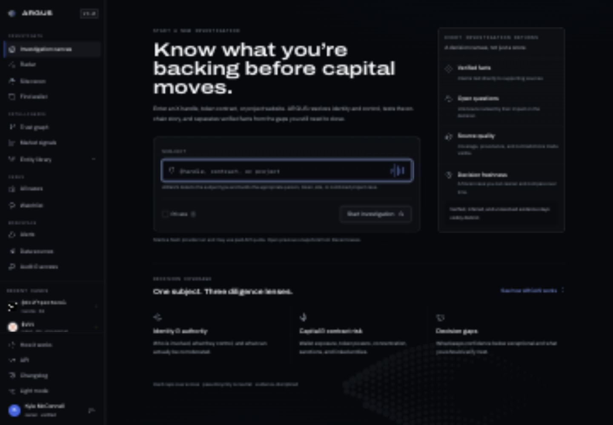
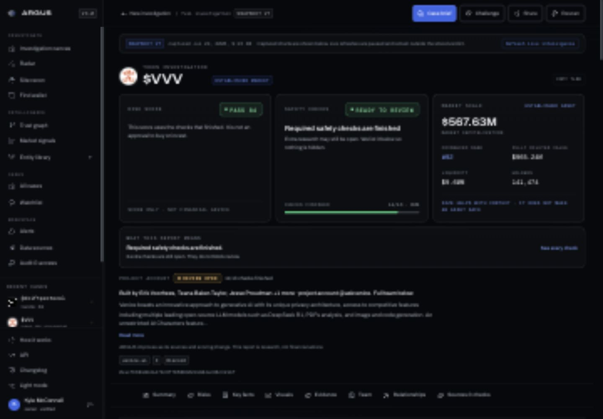
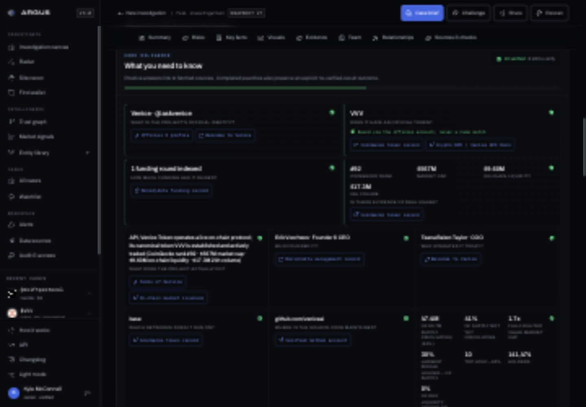
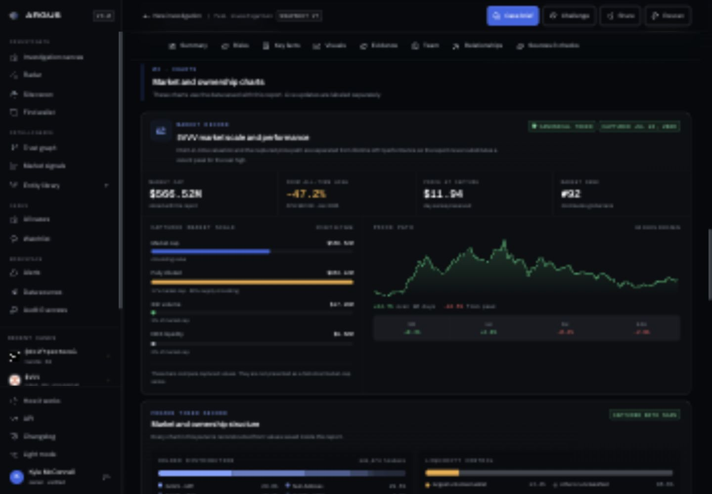
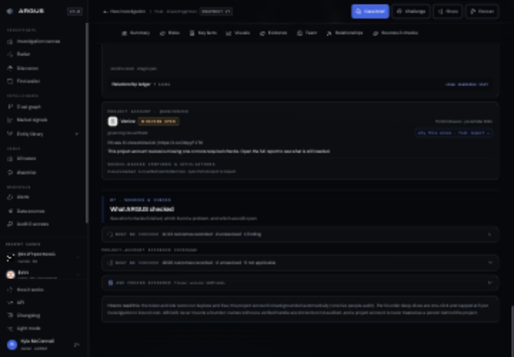
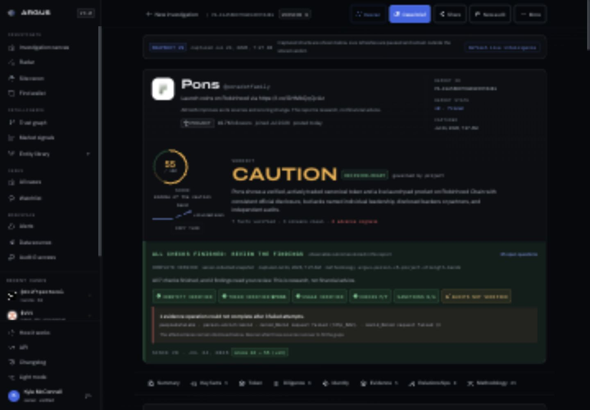
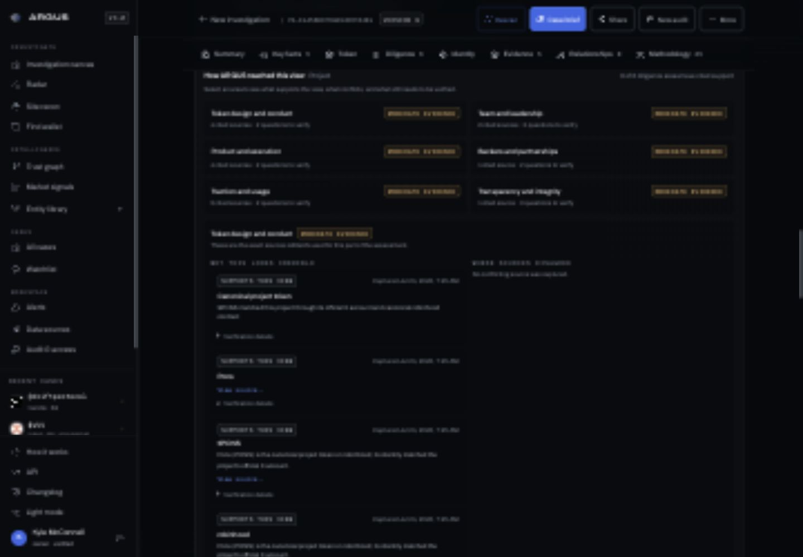
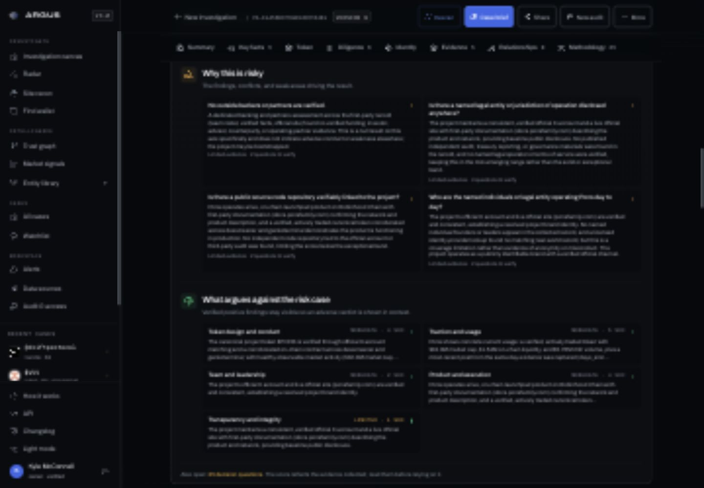

# ARGUS plain-language audit

Date: July 24, 2026

## General health

ARGUS has a strong visual system and unusually good source transparency. The main usability problem was not the styling. It was information hierarchy. The report repeated the same conclusion in several places, exposed internal scoring and collection language too early, and asked readers to understand the machinery before telling them what mattered.

The highest-impact change is progressive disclosure: the default view should answer three questions in order.

1. What checks out?
2. What needs attention?
3. What should I check next?

Source records, hashes, scoring rules, and provider detail remain available, but they should not compete with the answer.

## Screens reviewed

### 1. Home, desktop

The entry point explained subject routing, evidence states, and decision coverage before it explained the simple benefit of a scan.

### 2. Token report overview

The score, readiness state, check coverage, saved-report state, market context, and result explanation all appeared at once. Several of those blocks repeated the same message.

### 3. Key facts

The facts were useful, but generated answers could become full paragraphs. Terms such as “corroborated,” “explicit no-verified-result outcome,” and “canonical” added reading effort without helping the decision.

### 4. Market and charts

The data was valuable, but labels such as “captured market scale,” “frozen,” “live supplement,” and “forensic score profile” made a normal market section feel like an internal engineering view.

### 5. Checks and sources

The checklist exposed provider and pipeline terms such as “completion outcome not recorded,” “deployer trail,” “bytecode fingerprint,” and “trust-graph reconciliation.”

### 6. Person and project report overview

The result header mixed the verdict with version IDs, attestation state, methodology version, coverage language, and role-governance rules.

### 7. Why the score

The report repeated the result in a narrative, a decision-basis matrix, a verification plan, a source ledger, and a role breakdown. Each section was individually useful, but the full page lacked a clear reading order.

### 8. Risks and counterweights

Risk cards frequently rendered several complete paragraphs at once. “What argues against the risk case” and compact labels such as “Moderate · 4 src” required interpretation.

## Implemented changes

1. Rewrote the home page around plain outcomes: what checks out, what needs attention, and what to check next.
2. Replaced internal report language on the main reading path, including “decision-ready,” “governed by,” “corroborated,” “reconciliation,” “provenance,” “forensic,” “immutable,” and “frozen.”
3. Collapsed long fact answers, risk explanations, score rationales, and report descriptions behind “Show details.”
4. Moved report IDs, methodology versions, hashes, and source verification mechanics behind “Report details,” “Source details,” or “Technical details.”
5. Simplified the saved-versus-current-data boundary without changing the score or evidence rules.
6. Rewrote the methodology checklist so every status and common check name is understandable without crypto or data-pipeline knowledge.
7. Simplified market labels while keeping market cap, fully diluted value, price history, all-time-high loss, rank, liquidity, and holder data.
8. Renamed report sections to a clearer reading order: Summary, Key facts, Why this score, Identity, Sources, Relationships, and Checks.
9. Kept the model disclaimer visible: ARGUS changes as its sources and scoring improve, and the report is research rather than financial advice.

## Remaining design principle

Future features should earn space in the default view only when they change the decision. Everything else should be available on demand.
